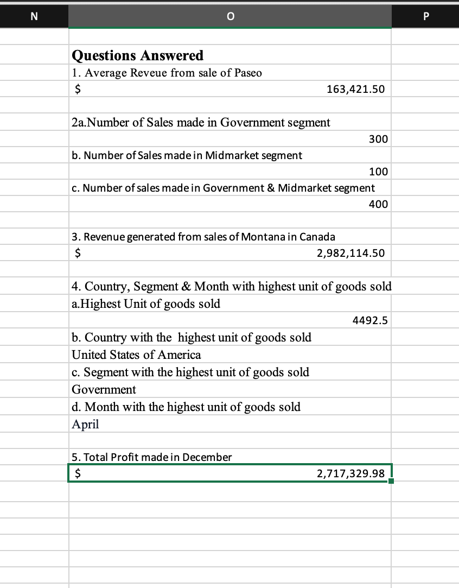

## Task 1 - Employee Data

---

## INTRODUCTION

This is data providing insights and explanations about employee data for a company called **Kezie Group** in Excel.
This is Data containing the information of employees in the company. We are provided with the Employee ID, Full Name, Department they work for, the salary they earn as well as their Job-status with the company.

**_Disclaimer_** : All datasets and reports do not represent any company, institution or country, but just a dummy dataset to demonstrate the capabilities of Excel.

Excel Concepts applied:

•	Data Filtering

•	Conditional Formatting

## PROBLEM STATEMENT

1.	Show the employees that are Freelancers and earn above $10,000.
2.	Checking for duplicates in terms of Employees
3.	Employees whose names begin with the letter “e” and find the lowest and highest salary in the company.

## DATA SOURCING

Created a table with the following headings
1. Employee ID
2. Employee Full Name
3. Department
4. Salary
5. Job type

## DATA ANALYSIS

First, We add the filter feature to the headers of the table and then we filter the job type section to select only freelancers, once you get only the freelancers and then filter the salary section to be greater than $10,000 for we discover the employees who are only employed as freelancers and earn above $10,000 by the company. We discover that there are 4 employees who are freelancers and earn above $10,000.

---

Conditional Formatting was used to search for duplicates. We look for any duplicates in terms of staff members and we discover that we do not have any duplicates even though we have staff whose first name is another employee's last name and another where the last name is the first name of another employee.

---

Conditional Formatting was used to highlight with a yellow fill, employees whose names start with an E. We then discover that we have three (3) employees whose first names begin with the letter E, Emma Miller, Emeka Dickson and Eugenie Bouchard. Conditional formatting was then used to find the lowest and also discover the lowest and highest salary earned by the employees at the company. The lowest salary is $5,000 and the highest earner at the company earns $25,000.

## SKills/ Concepts Demonstrated
The following Excel features were used to solve the problem.
- Data Filters,
- Conditional Formatting

## Conclusion
The Employee data is a very straightforward and easy-to-understand dataset.
- Kezie Group has four(4) employees who work as freelancers and earn above $10,000.
- There are no duplicates of employees that work at the company.
- There are three(3) employees with a name that begins with "e".
- The lowest salary is $5,000 and is earned by employees who work in the communication department on a part-time basis.
- The highest salary is $25,000 and is earned by employees who work in Sales and IT on both Part-time and Contract terms.
---

---
## TASK 2 - SALES DATA
---

## INTRODUCTION

This is data providing insights and explanations about sales data for a company that sells six (6) products in various countries of the world as well as segments that consume the products in Excel.
This is Data containing information on sales of products for a company. We are provided with the Segment, Country, Product, Discount Band, Unit Sold, Manufacturing Price, Sale Price, Gross Sales, Discounts, Sales, Profit, and Month.

**_Disclaimer_** : All datasets and reports do not represent any company, institution or country, but just a dummy dataset to demonstrate the capabilities of Excel.

Excel Concepts applied:
- SUM
- AVERAGE
- MAX
 

## PROBLEM STATEMENT
  
1. Find the total revenue and profit generated by the company from sales.
2. The average revenue and units sold for every order.
3. The total discount given in $.
4. The total number of sales they recorded.
5. The highest profit the company generated.
6. Show and indicate the sales below the average (low sales) and sales that were above the average (high sales).

## DATA SOURCING

The table details can be found in the uploaded files section of the repository called **Sales Data task.csv**.

## DATA ANALYSIS

First, we use the SUM() function to calculate the total revenue and profit generated.
Secondly, to find the average revenue for every order, we use the AVERAGE() function to calculate that and to find the total units sold for every order, we use the SUM() function.
Thirdly, for the total discount given, we use the SUM() function to sum all of the values under the discounts column.
Fourthly, for the total number of sales recorded, we use the SUM() function to sum up all the values under the sales column.
Fifthly, for the highest profit generated, we use the MAX() function to discover the biggest and largest profit the company made.

---
A column was created to indicate the sales that were low and sales that were high because they were above the average.
The table details can be found in the uploaded files section of the repository called **Sales Data task solved**.

## SKILLS / CONCEPTS DEMONSTRATED
The following Excel features were used to solve the problems
- SUM
- AVERAGE
- MAX

## CONCLUSION
The sales data was quite big so it required a lot of careful analysis. The amount of low sales is much greater than the high sales.

---
## TASK 3
---

## INTRODUCTION

This is data providing insights and explanations about sales data for a company that sells six (6) products in various countries of the world as well as segments that consume the products in Excel.
This is Data containing information on sales of products for a company. We are provided with the Segment, Country, Product, Discount Band, Unit Sold, Manufacturing Price, Sale Price, Gross Sales, Discounts, Sales, Profit, and Month.

**_Disclaimer_** : All datasets and reports do not represent any company, institution or country, but just a dummy dataset to demonstrate the capabilities of Excel.

Excel Concepts applied:
- AVERAGEIF
- COUNTIF
- SUM
- SUMIFS
- MAX
- XLOOKUP

## PROBLEM STATEMENT

1. Find the average revenue generated from the sale of 'Paseo'.
2. Find the number of sales made in the Government and Midmarket segments.
3. Total revenue generated from the sales of "Montana" in Canada.
4. What country, segment and month did they sell the highest unit of goods?
5. The total profit made in the month of December.

## DATA SOURCING

The table details can be found in the uploaded files section of the repository called **Sales Data task solved.csv**.

## DATA ANALYSIS

First, we use the AVERAGEIF(C2:C701, "Paseo", J2:J701) function to calculate the average revenue 'Paseo' generates.
Secondly, to figure out the number of sales made in the government and midmarket segments, we use the COUNTIF() function to find out the sales made in the government segment, the sales made in the midmarket segment and then use the SUM() function to add both figures to give us the number of sales made in the government and midmarket segment together.
Thirdly, we use the SUMIFS(H2:H701,B2:B701,"Canada",C2:C701,"Montana") function to find out the total revenue generated from the sales of 'Montana' in Canada.
Fourthly, we, first of all, calculate the highest unit of goods sold by using the MAX(E2:E701) function, then use the highest unit of goods sold as your lookup value. You make use of XLOOKUP() function to find out the country, segment and month the highest unit of goods sold was made.
Fifthly, to discover the total profit that was made in the month of December, we use the SUMIFS(K2:K701,L2:L701,"December") function.

## SKILLS / CONCEPTS DEMONSTRATED
The following Excel features were used to solve the problems
- SUMIFS
- AVERAGEIF
- MAX
- XLOOKUP
- COUNTIF

## CONCLUSION
The sales data was quite big so it required a lot of careful analysis. 
The number of sales made in the Government and Midmarket segments is 400; 300 for government segment and 100 for the midmarket segment.
The country with the highest unit of goods sold is the United States of America, the segment with the highest unit of goods sold is the Government and the month the highest unit of goods were sold is April.

